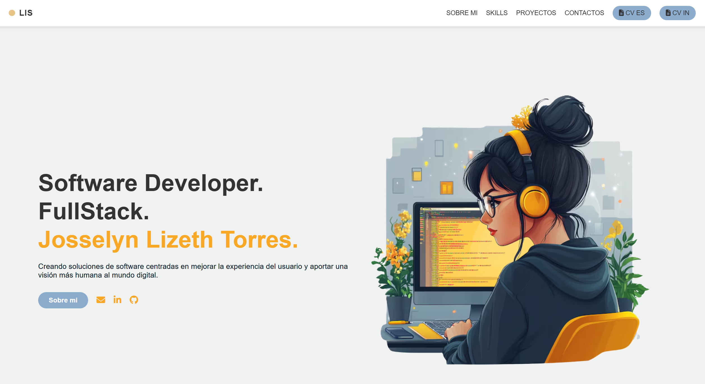

# 💼 Portafolio Personal - Josselyn Lizeth Torres

¡Hola! Soy **Josselyn Lizeth Torres**, desarrolladora FullStack apasionada por crear soluciones tecnológicas que mejoran la vida de las personas.

Este repositorio contiene el código fuente de mi portafolio web personal. Aquí muestro mis proyectos, habilidades técnicas, formación y formas de contacto.

---

## ✨ Características

- Diseño moderno, limpio y responsive
- Secciones: Sobre mí, Skills, Proyectos, Contacto
- Navegación suave con anclas internas
- Totalmente desarrollado con **HTML**, **CSS** y algo de **JavaScript**

---

## 🧰 Tecnologías usadas

- HTML5
- CSS3 (flexbox, media queries, gradients...)
- JavaScript 
- Shields.io (para iconos de tecnologías)
- FontAwesome (para iconos sociales)
- Git + GitHub

---

## 🧪 Cómo verlo en vivo

Puedes ver el portafolio funcionando en:

🔗 [https://lisjtr.github.io/mi-porfolio/

---

## 📂 Estructura del proyecto

  - 📁 /assets
  - 📁 /images
  - 📁 /download → Archivos PDF del CV
  - 📄 index.html → Página principal
  - 📄 style.css → Estilos principales
